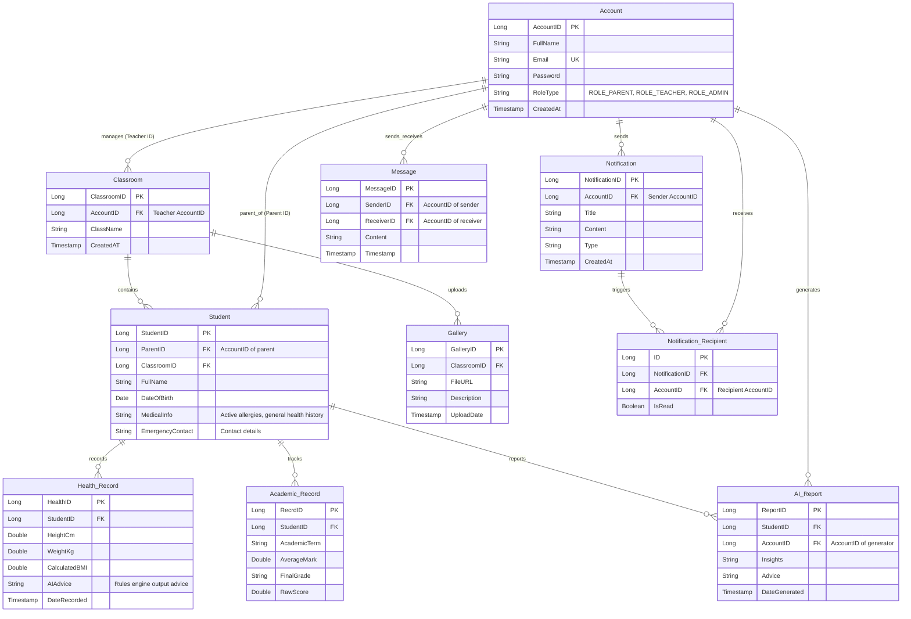

# MyTadika — Core System Development Plan
## React Frontend & Spring Boot Backend Integration

> **Scope**: Implementation framework for the School-Parent Engagement System (MyTadika), focusing on digitizing student records, academic performance tracking, and health & nutritional analysis with AI integrations.

---

## 1. Architectural & Technology Stack

The application follows a secure, decoupled, three-tier architecture with role-based access controls (RBAC) separating administrative actions (Teachers/Admin) and viewing operations (Parents).

```
 ┌────────────────────────────────────────────────────────┐
 │                      FRONTEND TIER                     │
 │          React.js Web App (Vite + CSS Modules)         │
 └───────────────────────────┬────────────────────────────┘
                             │
                             ▼ (HTTPS / JSON REST API)
 ┌────────────────────────────────────────────────────────┐
 │                      BACKEND TIER                      │
 │          Spring Boot Application (Java 17/21)         │
 │   ├─ Spring Security & JWT Token-based Auth            │
 │   ├─ Spring Data JPA (Hibernate ORM)                   │
 │   ├─ HealthAdviceService (Ported Java Rules Engine)    │
 │   └─ AiPredictionClient (Calls FastAPI service)        │
 └───────────────────────────┬─────────────┬──────────────┘
                             │             │
                             │             ▼ (HTTP REST on Port 8001)
                             │       ┌────────────────────────────┐
                             │       │      AI INFRASTRUCTURE     │
                             │       │      Python FastAPI        │
                             │       │  └─ XGBoost ML Model      │
                             │       └────────────────────────────┘
                             ▼ (JDBC Connection)
 ┌────────────────────────────────────────────────────────┐
 │                    DATABASE TIER                       │
 │        PostgreSQL / MySQL / SQLite Relational DB       │
 └────────────────────────────────────────────────────────┘
```

### Technology Matrix
*   **Frontend**: React 18, React Router v6, Axios (Client-side HTTP), Chart.js / Recharts (Growth charts), CSS Modules / CSS Variables.
*   **Backend**: Spring Boot 3.x, Java 17, Spring Security, Spring Web, Spring Data JPA, JSR-380 validation, Lombok, JWT (jjwt).
*   **Database**: PostgreSQL or MySQL for production (SQLite or H2 for local test configurations).
*   **AI Microservice**: FastAPI, Uvicorn, joblib, scikit-learn, XGBoost.

---

## 2. Relational Database Design



---

## 3. Spring Boot Backend Implementation Plan

### Task B1 — Project Initialization & Security Layer
*   [ ] **Initialize Spring Boot Project**: Set up a Maven project inside the `mytadika-backend` folder with standard dependencies.
*   [ ] **Configure Database Properties**: Configure PostgreSQL/MySQL datasource properties in `src/main/resources/application.yml`.
*   [ ] **Create Security & JWT Infrastructure**:
    *   Implement `JwtUtils` to generate, parse, and validate HS256 JWT tokens.
    *   Create `JwtAuthFilter` extending `OncePerRequestFilter` to intercept headers and populate `SecurityContextHolder`.
    *   Configure `SecurityConfig` to disable basic authentication, establish stateless session management, configure password hashing (`BCryptPasswordEncoder`), and set path authorizations:
        *   `/api/auth/**` $\rightarrow$ public
        *   `/api/teacher/**` $\rightarrow$ requires `ROLE_TEACHER` or `ROLE_ADMIN`
        *   `/api/parent/**` $\rightarrow$ requires `ROLE_PARENT`
        *   `/api/health/**` $\rightarrow$ authenticated
*   [ ] **Establish Global Exception Handling**:
    *   Create `@ControllerAdvice` to intercept validator exceptions, database constraint violations, and customized `ResourceNotFoundExceptions` returning clean JSON structures:
        ```json
        {
          "timestamp": "2026-06-16T23:28:00Z",
          "status": 400,
          "error": "Bad Request",
          "message": "Validation failed: ageMonths must be less than or equal to 72"
        }
        ```

### Task B2 — Core JPA Entities & Repositories
*   [ ] **Map Database Entities**:
    *   `Account.java` (Entity representing accounts: parents, teachers, and admins).
    *   `Classroom.java` (Entity representing classrooms managed by a teacher).
    *   `Student.java` (Entity containing student details, `MedicalInfo`, `EmergencyContact`, linked to a parent and a classroom).
    *   `AcademicRecord.java` (Entity representing student performance, linked to `Student` via `StudentID`).
    *   `HealthRecord.java` (Entity representing child measurements, linked to `Student` via `StudentID`).
    *   `AIReport.java` (Entity representing generated AI advice reports, linked to both `Student` and `Account`).
    *   `Gallery.java` (Entity representing shared moments/photos in classrooms).
    *   `Notification.java` & `NotificationRecipient.java` (Entities representing user notification systems).
    *   `Message.java` (Entity representing direct parent-teacher communications).
*   [ ] **Create Spring Data Repositories**:
    *   Create corresponding interfaces for each entity extending `JpaRepository`.
    *   Add query methods: `findByParentID(Long parentId)`, `findByStudentIDOrderByDateRecordedDesc(Long studentId)`.

### Task B3 — Academic Performance Tracker Service
*   [ ] **Grade Engine Implementation**:
    *   Implement grade classification rules based on Malaysia preschool standards inside `AcademicRecordService.java`:
        *   $[80, 100] \rightarrow A$ (Excellent)
        *   $[70, 79] \rightarrow B$ (Good)
        *   $[60, 69] \rightarrow C$ (Satisfactory)
        *   $[50, 59] \rightarrow D$ (Passing)
        *   $[40, 49] \rightarrow E$ (Borderline)
        *   $[0, 39] \rightarrow F$ (Unsatisfactory)
*   [ ] **Endpoints (`AcademicController.java`)**:
    *   `POST /api/teacher/academic/record` (Input raw exam mark $\rightarrow$ returns calculated grade $\rightarrow$ persists record).
    *   `GET /api/parent/academic/report-card/{studentId}` (Fetches child's records with term averages).

### Task B4 — AI Health Prediction & Rules Engine Client
*   [ ] **FastAPI Integration Client (`AiPredictionClient.java`)**:
    *   Use Spring Boot's `RestClient` or `WebClient` to transmit anthropometric measurements to the Python AI Microservice (`POST http://localhost:8001/api/predict`).
    *   Implement fallback state: If the FastAPI microservice is offline, default to rule-based fallback predictions based on basic BMI calculations.
*   [ ] **Java Rules Engine (`HealthAdviceService.java`)**:
    *   Load `advice_templates.json` into memory from classpath resource at startup.
    *   Port logic from `healthAdviceEngine.js`:
        *   Map ML output label to key (`normal` $\rightarrow 1$, `moderate` $\rightarrow 0$, `severe` $\rightarrow 0$).
        *   Apply **Allergy Guardrails**: Parse the child's `active_allergies` and filter out any advice item matching the allergy keywords list (suppress dairy tips for `milk` allergy, nut tips for `peanut` allergy).
        *   Apply **Rotation logic**: Filter/sort using lists of previously recorded advice IDs stored in the database.
        *   Add **Confidence caveat** if prediction confidence is below $70\%$.
        *   Check for **Urgent Referrals**: If `status == "severe"` or the SAM flag is raised, prepend medical guidelines and warnings.
*   [ ] **Endpoints (`HealthController.java`)**:
    *   `POST /api/teacher/health/record`: Record child's height, weight, and MUAC $\rightarrow$ invoke FastAPI prediction $\rightarrow$ run Rules Engine $\rightarrow$ persist record $\rightarrow$ return generated advice card.
    *   `GET /api/parent/health/dashboard/{studentId}`: Get child's latest BMI, nutrition status, allergy warning headers, and rotating health advice.

---

## 4. React Frontend Implementation Plan

### Task F1 — Framework Bootstrap & Routing Configuration
*   [ ] **Scaffold Application**: Create React structure using Vite inside the main directory.
*   [ ] **Set up Global CSS**: Define core typography, HSL colour palette variables (with green/amber/red indicators), global resets, and glassmorphism templates.
*   [ ] **Establish Router Structure (`App.jsx`)**:
    *   Create routes: `/login` (Public), `/teacher/dashboard` (Teacher Protected), `/parent/dashboard` (Parent Protected).
    *   Implement `RequireRole` Route Wrapper checking context credentials to redirect users trying to access illegal paths.

### Task F2 — Authentication & Shared Components
*   [ ] **Auth Context (`AuthContext.jsx`)**:
    *   Manage authenticated state, stored tokens (using Secure Cookie or LocalStorage), and active user details (role, username, ID).
*   [ ] **Axios Client wrapper (`apiClient.js`)**:
    *   Inject `Authorization: Bearer <token>` interceptor into outbound REST actions.
    *   Implement interceptors to wipe expired credentials on `401 Unauthorized` responses and redirect users to `/login`.
*   [ ] **Shared Page Elements**:
    *   Build responsive navbar showing MyTadika branding, user profile indicator, and logout action.

### Task F3 — Teacher Dashboard (Data Input Interface)
*   [ ] **Student Directory Grid**:
    *   List view of students in classes with Search filters by name.
    *   Add modal/page form to add new students and configure their parent linkages.
*   [ ] **Academic Input Page**:
    *   Spreadsheet-like tabular interface allowing teachers to record subject marks for all children in one session.
    *   Interactive client-side validations preventing entries $>100$ or $<0$.
*   [ ] **Health Log Panel**:
    *   Form input for weight (kg), height (cm), and MUAC (cm) with real-time BMI estimation on keyup.
    *   "AI Analyze" submit action that displays an overlay showing the returned nutrition status and safety-check recommendations.

### Task F4 — Parent Dashboard (Information Analytics)
*   [ ] **Overview Hub**:
    *   Child summary cards depicting current height, weight, and a bold colour-coded nutritional status pill (🟢 Healthy, 🟡 Concern, 🔴 Urgent Action).
*   [ ] **Interactive Growth Charts**:
    *   Render line charts displaying historical records of Weight, Height, and BMI plotted against standard WHO percentile bands.
*   [ ] **AI Advice panel**:
    *   Display selected dietary guidelines, activity checklists, and medical disclaimers in card formats.
    *   **Allergy Alerts Banner**: Persistent, highlighted warnings at the top of the interface for children with active allergy records.
*   [ ] **Report Card Tab**:
    *   List view displaying term examinations, marks, calculated grades, and final teacher assessments.

---

## 5. Implementation Roadmap & Milestones

```
┌────────────────────────────────────────────────────────────────────────┐
│  Phase 1: Database and API Contracts (3 Days)                         │
│  ├─ Database Schemas & Spring Boot REST API scaffolding               │
│  └─ FastAPI deployment on port 8001                                    │
└───────────────────────────────────┬────────────────────────────────────┘
                                    │
                                    ▼
┌────────────────────────────────────────────────────────────────────────┐
│  Phase 2: Spring Boot Services & Operations (4 Days)                  │
│  ├─ User Authentication & Profile REST endpoints                       │
│  ├─ Academic grade calculations                                        │
│  └─ Java Rules Engine (Allergy filters, caveats, template loaders)     │
└───────────────────────────────────┬────────────────────────────────────┘
                                    │
                                    ▼
┌────────────────────────────────────────────────────────────────────────┐
│  Phase 3: React Frontend Development (5 Days)                          │
│  ├─ Dashboard routings & API integrations                              │
│  ├─ Teacher mark sheets and measurement entries                        │
│  └─ Parent analytical cards, charts, and advice panels                │
└───────────────────────────────────┬────────────────────────────────────┘
                                    │
                                    ▼
┌────────────────────────────────────────────────────────────────────────┐
│  Phase 4: Verification and QA (2 Days)                                 │
│  ├─ Spring Boot controller & service unit testing                      │
│  └─ End-to-end user scenario mock runs                                 │
└────────────────────────────────────────────────────────────────────────┘
```
